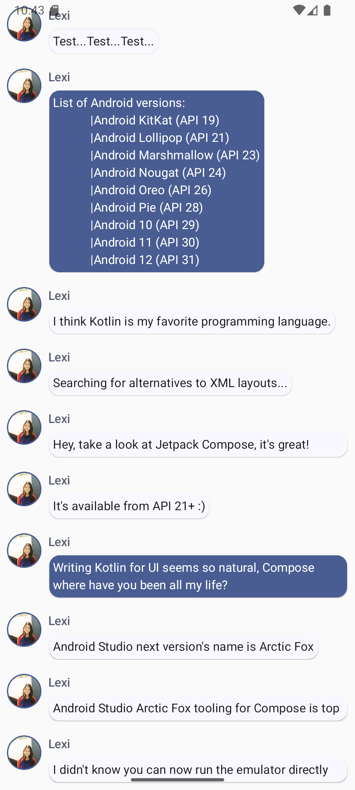

## Compose Tutorial
A quick tutorial I did to learn about Jetpack Compose, a UI framework for Android. Learned about `@Composable` and how it can be used to modularize view components. Felt very similar to SwiftUI and React, both of which I have experience with. 

The app is a messages app. Users can click a message to expand its content, which changes the appearance of the image with a smooth animation.

